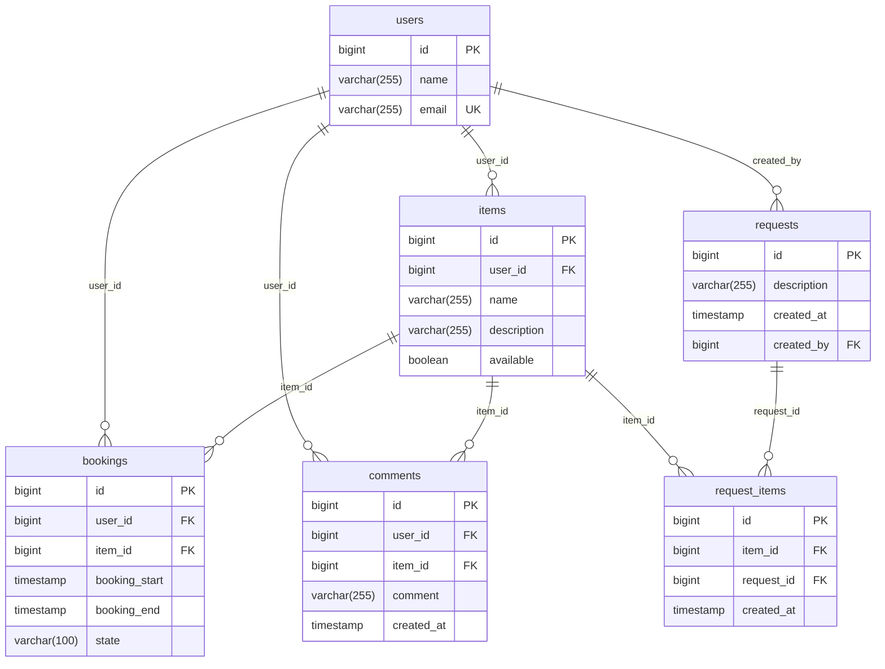

# java-shareit
Template repository for Shareit project.

## DataBase

```mermaid
erDiagram
users{
    bigint id PK
    varchar(255) name
    varchar(255) email UK
}

items{
    bigint id PK
    bigint user_id FK
    varchar(255) name
    varchar(255) description
    boolean available
}

bookings{
    bigint id PK
    bigint user_id FK
    bigint item_id FK
    timestamp booking_start
    timestamp booking_end
    varchar(100) state
}

comments{
    bigint id PK
    bigint user_id FK
    bigint item_id FK
    varchar(255) comment
    timestamp created_at
}

requests{
    bigint id PK
    varchar(255) description
    timestamp created_at
    bigint created_by FK
}

request_items{
    bigint id PK
    bigint item_id FK
    bigint request_id FK
    timestamp created_at
}

users ||--o{ items: user_id
users ||--o{ bookings: user_id
items ||--o{ bookings: item_id
users ||--o{ comments: user_id
items ||--o{ comments: item_id
users ||--o{ requests: created_by
items ||--o{ request_items: item_id
requests ||--o{ request_items: request_id

```